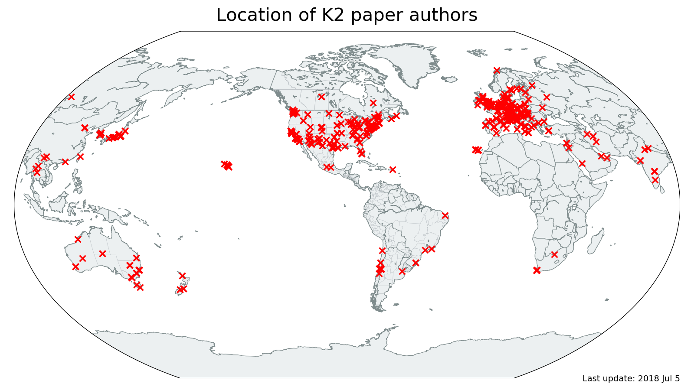

# Community world map

The scripts in this directory can be used to geolocate the authors
of all publications and plot them on a world map.

## Usage:
```
python 1-get-coordinates.py
python 2-plot-map.py
```

## Output

The output is a file called `k2-authors-world-map.png`:


